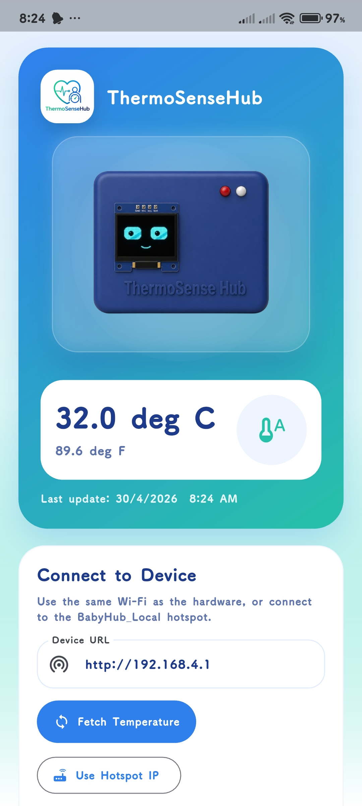

# ThermoSenseHub Showcase 🚀
Official showcase website for ThermoSenseHub – Smart Baby Temperature Monitoring App with real-time tracking, alerts, and IoT integration.

## 📱 Features
- Real-time temperature monitoring
- Mobile app integration
- Alerts & notifications
- IoT-based tracking
- Smart Alert System
- Status Classification
- Basic Care Guidance
- Offline + Local Access

## 🌐 Live Website
(https://thermo-sense-hub-hh2t.vercel.app/)

## 📥 Download App
[Download APK](https://github.com/shovinmd/thermosensehub-App-showcase/releases/download/v1.0/ThermoSenseHub.v.1.apk)

## 🖼 Screenshots

## 🛠 Tech Used
- HTML
- CSS
- JavaScript

## 📌 Author
Shovin Michel David
